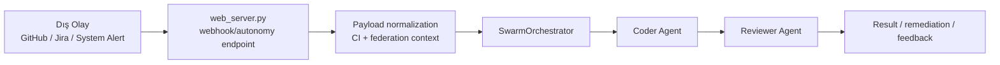

# SİDAR v5.1 — Faz C Derinleşme ve İleri Otonomi Mimari Raporu

> **Durum:** v5.0.0-alpha runtime baseline üzerinde Faz C yetenekleri ile Faz D kurumsal ölçekleme teslimatları senkronize edilmiş, Faz E otonom iş ekosistemi vizyonu resmi mimari yol haritasına eklenmiştir.
> **Hazırlanma Tarihi:** 2026-03-21
> **Kapsam:** `web_ui_react/src/components/VoiceAssistantPanel.jsx`, `web_ui_react/src/hooks/useVoiceAssistant.js`, `core/voice.py`, `web_server.py`, `core/ci_remediation.py`, `agent/sidar_agent.py`, `agent/roles/reviewer_agent.py`, `managers/code_manager.py`, `managers/browser_manager.py`, `agent/swarm.py`, `github_upload.py`, `web_ui_react/src/components/PluginMarketplacePanel.jsx`, `web_ui_react/src/components/AgentManagerPanel.jsx`, `web_ui_react/src/hooks/useWebSocket.js`, `tests/test_plugin_marketplace_hot_reload.py`, `tests/test_collaboration_workspace.py`, `tests/test_nightly_memory_maintenance.py`, `tests/test_system_health_dependency_checks.py`, `runbooks/chaos_live_rehearsal.md`, `agent/tooling.py`, `core/multimodal.py`

---

## 1. Yönetici Özeti

SİDAR artık yalnızca backend tarafında güçlü capability'lere sahip bir AI yardımcı değil; React istemcisi, WebSocket ses akışı, self-healing remediation döngüsü ve event-driven swarm federation zinciriyle daha bütüncül bir **AI Agentic Worker** omurgasına yaklaşmıştır. Faz C derinleşmesi dört eksende somutlaşmaktadır:

1. **Client-side voice UX:** `VoiceAssistantPanel` + `useVoiceAssistant` ikilisi, mikrofon erişimi, canlı VAD, transcript, diagnostics ve barge-in görünürlüğünü React SPA içine taşır.
2. **Self-healing loop:** CI failure bağlamı `core/ci_remediation.py` içinde normalize edilir; `agent/sidar_agent.py` düşük riskli patch planı üretir, `CodeManager` sandbox'ında doğrular ve başarısız olursa rollback uygular.
3. **Deeper browser decisioning:** `BrowserManager`, screenshot ve DOM yakalama sinyallerini reviewer/browser tooling katmanına taşıyarak deterministik selector odaklı operasyonları güçlendirir.
4. **Event-driven federation:** Webhook/cron/federation olayları `web_server.py` tarafından normalize edilip `SwarmOrchestrator` üstünde Coder → Reviewer pipeline'ına dağıtılır.

---

## 2. Faz C Bileşen Haritası

| Başlık | Uygulama yüzeyi | Mimari sonuç |
|---|---|---|
| Client-side duplex voice | `VoiceAssistantPanel.jsx`, `useVoiceAssistant.js`, `/ws/voice`, `core/voice.py` | Kullanıcı sesi, VAD ve TTS döngüsü tam çift yönlü UX olarak görünür hale geldi. |
| Otonom remediation | `core/ci_remediation.py`, `agent/sidar_agent.py`, `managers/code_manager.py` | Düşük riskli CI arızalarında patch + sandbox validation + rollback zinciri kurulmuş oldu. |
| Reviewer kalite kapısı | `agent/roles/reviewer_agent.py`, `core/rag.py`, `managers/browser_manager.py` | LSP, GraphRAG ve browser sinyalleri ortak inceleme yüzeyine aktı. |
| Event-driven federation | `web_server.py`, `agent/swarm.py`, `github_upload.py` | Dış olaylar doğrudan çok ajanlı workflow'a dönüştürülebiliyor. |

---

## 3. Client-Side Voice Mimari Akışı

### 3.1 Bileşen sorumlulukları

- **`VoiceAssistantPanel.jsx`** kullanıcıya mikrofon durumu, transcript, VAD seviyesi, interruption nedeni, turn numarası ve buffered byte bilgisini gösterir.
- **`useVoiceAssistant.js`** `getUserMedia`, `MediaRecorder`, `AnalyserNode` ve `/ws/voice` bağlantısını tek hook altında birleştirir.
- **`core/voice.py`** duplex state, assistant turn metadata, VAD event'leri ve TTS segmentasyonunu yönetir.
- **`web_server.py` `/ws/voice`** auth, payload limitleri, transcript/voice_state yayınları ve voice interruption olaylarını taşır.

### 3.2 Veri akışı

```mermaid
flowchart LR
    A[React UI
VoiceAssistantPanel] --> B[useVoiceAssistant
MediaRecorder + VAD]
    B --> C[/ws/voice WebSocket]
    C --> D[web_server.py
voice session/auth]
    D --> E[core/voice.py
buffer + VAD + duplex state]
    E --> F[STT / transcript]
    E --> G[TTS segmentleri]
    F --> C
    G --> C
    C --> B
    B --> A
```

### 3.3 Faz C kazanımı

Bu akış sayesinde barge-in yalnızca backend olayından ibaret değildir; istemci state'i de `playing → interrupted → capturing` geçişini görünür biçimde izler. Böylece sesli kod inceleme veya incident triage oturumları ürün UX'inin bir parçasına dönüşür.

---

## 4. Self-Healing ve Otonom Remediation

### 4.1 Akış tanımı

1. CI başarısızlığı webhook veya autonomy trigger olarak alınır.
2. `core/ci_remediation.py`, kök neden özeti, şüpheli dosyalar, güvenli validation command'ları ve remediation loop planını üretir.
3. `agent/sidar_agent.py`, yalnızca düşük riskli ve geri alınabilir patch operasyonlarına izin veren JSON planı ister.
4. `managers/code_manager.py`, patch'leri uygular ve validation komutlarını sandbox içinde çalıştırır.
5. Doğrulama başarısız olursa dosya snapshot'ları üzerinden rollback uygulanır; yüksek riskli akışlar HITL onayına döner.

### 4.2 Karar ilkeleri

- **Fail-safe:** Patch planı boşsa veya yalnızca güvenli komutlara uymuyorsa uygulama bloklanır.
- **Rollback-first güvenlik:** Doğrulama başarısız olduğunda değişiklikler geri alınır.
- **Scope control:** Görev kapsamı remediation loop içindeki dosyalarla sınırlandırılır.
- **Human override:** Timeout, yüksek risk veya kapsam dışı mutasyon durumunda HITL devreye girer.

---

## 5. Browser Decisioning Derinleşmesi

`managers/browser_manager.py` mevcut haliyle Playwright/Selenium oturumu açma, URL gezme, selector tabanlı tıklama/doldurma, screenshot alma ve DOM yakalama yeteneklerini güvenli alan/adres politikaları ve HITL geçidiyle sunar. Faz C bağlamında bunun mimari anlamı şudur:

- Reviewer ajanı browser_signals aracıyla ekran görüntüsü, URL, selector ve DOM özetini kalite kapısına taşıyabilir.
- Tarayıcı etkileşimleri serbest-form LLM tahmini yerine typed tool schema + selector odaklı adımlarla yürür.
- Dinamik UI drift'leri artık yalnızca metin loglarıyla değil, DOM/screenshot kanıtlarıyla değerlendirilebilir.

> Not: Mevcut kod tabanı DOM capture + screenshot + selector tabanlı deterministik akış sunmaktadır; daha ileri görsel işaretleme katmanları sonraki iterasyon için doğal genişleme alanıdır.

---

## 6. Event-Driven Swarm Federation

### 6.1 Olay akışı



### 6.2 Mimari sonucu

- GitHub PR/CI olayları, Jira issue açılışları ve sistem alarmları doğrudan görev zarfına dönüştürülebilir.
- Coder ve Reviewer aynı correlation-id ile pipeline içinde çalışır.
- Üretilen federation sonucu hem dış sisteme geri taşınabilir hem de SidarAgent external trigger hafızasına kaydedilebilir.

---

## 7. Operasyonel Doğrulama ve Test Eşleşmesi

| Alan | İlgili testler |
|---|---|
| Duplex voice pipeline | `tests/test_voice_pipeline.py`, `tests/test_web_server_voice.py` |
| Browser automation / browser signals | `tests/test_browser_manager.py` |
| Self-healing remediation | `tests/test_ci_remediation.py`, `tests/test_web_server_autonomy.py` |
| Federation ve contracts | `tests/test_contracts_federation.py`, `tests/test_web_server_autonomy.py` |

---

## 8. Sonuç

Faz C derinleşmesi, SİDAR'ın mimarisini üç açıdan olgunlaştırmıştır: kullanıcı deneyimi istemci tarafında sesli etkileşimi görünür hale getirmiştir; backend tarafında self-healing ve event-driven federation ile reaktif model aşılmıştır; reviewer/browser/GraphRAG birleşimi ise karar kalitesini ve denetlenebilirliği artırmıştır. Bu nedenle v5.1 mimari raporu, mevcut kod tabanını v5.0'ın ötesine geçen bir **ileri otonomi baseline'ı** olarak belgelemektedir.

## 8.1 Orta Vade Mimari Hazırlıklar: GraphRAG ve Dağıtık Swarm

1. **GraphRAG + Knowledge Graph derinleşmesi:** Mevcut `pgvector` odaklı retrieval omurgası, varlık/ilişki çıkarımı yapan bir Knowledge Graph katmanı ile eşleştirilerek çok adımlı ve kompleks problemlerde bağımlılık zincirlerini, aktörler arası ilişkileri ve görevler arası nedenselliği daha doğru modelleyecek şekilde genişletilmelidir.
2. **İlişkisel çıkarımın reviewer/remediation döngüsüne bağlanması:** Knowledge Graph düğümleri yalnızca arama kalitesini artırmak için değil; reviewer etki analizi, self-healing remediation planı ve external trigger korelasyonu için de ikincil karar yüzeyi olarak kullanılmalıdır.
3. **Dağıtık swarm hazırlığı:** Ajanların tek bir Python süreci içinde çalıştığı mevcut topoloji, Kubernetes pod'ları seviyesinde izole edilmiş uzman worker'lara ayrılacak şekilde evrilmelidir. Bu dönüşüm için görev sözleşmeleri, broker mesaj şemaları, correlation-id taşıma ve retry/timeout politikaları bugünden standartlaştırılmalıdır.
4. **Broker tabanlı orkestrasyon:** RabbitMQ/Kafka benzeri message broker katmanı, swarm görevlerini kuyruklayan, tenant izolasyonunu güçlendiren ve yatay ölçeklemeyi kolaylaştıran ana omurga olarak konumlandırılmalıdır. Böylece dağıtık sürü mimarisine geçiş yalnızca altyapı değil, gözlemlenebilirlik, hata toleransı ve güvenlik sınırları bakımından da kontrollü hazırlanmış olur.

---

## 9. Faz E: Otonom İş Ekosistemi (Poyraz & Coverage)

### 9.1 Test Otomasyonu (Coverage Ajanı)

- Yeni swarm birimi, `pytest` ve coverage çıktılarındaki açık satırları `managers/code_manager.py` üzerinden okuyup eksik senaryolara otomatik test üreten bir kalite ajanı olarak konumlanacaktır.
- Amaç, Faz D ile genişleyen plugin marketplace, collaboration workspace, nightly memory maintenance ve dependency resilience yüzeylerinde `%100` hard gate kültürünü insan müdahalesi olmadan sürdürebilmektir.
- Reviewer ve remediation zinciriyle birleştiğinde Coverage Agent, “sorunu bul → testini yaz → düzeltmeyi doğrula” döngüsünü tamamlayan yeni QA halkasını temsil eder.

### 9.2 Dijital Pazarlama & Operasyonlar (Poyraz Ajanı)

- `agent/tooling.py` üzerinde genişletilecek sosyal ağ ve iş operasyonu araçları; Instagram, Facebook ve WhatsApp kanallarına içerik gönderimi, kampanya operasyonu ve müşteri iletişimi için typed tool yüzeyi sağlayacaktır.
- Poyraz, yalnızca paylaşım yapan bir bot değil; web sitesi taslakları, landing page içerikleri, kampanya metinleri ve operasyon checklist'leri üreten dışa dönük bir iş ajanı olarak tasarlanır.
- Bu katman, SİDAR'ı tek departmanlı bir yazılım ajanından çok departmanlı bir dijital işletme simülasyonuna doğru genişletir.

### 9.3 Genişletilmiş Multimodal Zeka

- `core/multimodal.py` hattı yerel `.mp4` işleme sınırını aşarak YouTube ve benzeri dış platformlardan video akışlarını alıp FFmpeg + vision modelleri ile çözümleyen bir ingestion katmanına genişletilecektir.
- Videodan üretilen transkript, sahne özeti ve görsel/işitsel içgörüler; Poyraz tarafından otomatik sosyal medya içeriği, kampanya brief'i ve pazarlama metnine dönüştürülebilecektir.
- Böylece multimodal katman, yalnızca geliştiriciye medya özeti veren yardımcı modül olmaktan çıkarak gelir/pazarlama operasyonlarını besleyen stratejik veri boru hattına dönüşecektir.

### 9.4 Yapısal Yerleşim Taslağı (Tablolar ve API Uçları)

| Faz E bileşeni | Kullanacağı mevcut yüzeyler | Önerilen yeni tablo/endpoint taslağı | Not |
|---|---|---|---|
| Coverage Agent | `managers/code_manager.py`, `agent/sidar_agent.py`, `core/db.py` prompt registry, `/api/swarm/execute`, CI test akışları | `coverage_tasks`, `coverage_findings`, `/api/qa/coverage/run`, `/api/qa/coverage/findings` | Coverage raporlarını ingest edip eksik senaryoları görevleştiren QA boru hattı. |
| Poyraz Ajanı | `agent/tooling.py`, `web_server.py` auth/audit/multitenancy, mevcut entegrasyon yöneticileri | `marketing_campaigns`, `content_assets`, `operation_checklists`, `/api/operations/campaigns`, `/api/operations/content/generate`, `/api/integrations/social/publish` | Kampanya, içerik ve operasyon checklist'lerini audit edilebilir tenant bağlamında çalıştırır. |
| YouTube / dış video analizi | `core/multimodal.py`, `web_server.py` upload/vision akışları, RAG/DocumentStore | `media_ingestion_jobs`, `media_scene_segments`, `media_transcripts`, `/api/media/analyze-url`, `/api/media/jobs/{job_id}`, `/api/media/transcripts/{job_id}` | URL tabanlı ingest, FFmpeg sahne/segment çıkarımı ve özet metin üretimi. |

#### 9.4.1 Coverage Agent veri ve kontrol akışı

- Coverage Agent, CI veya yerel `pytest --cov` çıktısını görev tetikleyicisi olarak alır; ham coverage raporu `coverage_tasks` içinde saklanır ve her açık satır/branch kaydı `coverage_findings` tablosunda normalize edilir.
- `managers/code_manager.py`, eksik test önerilerini üretmek ve doğrulama komutlarını koşturmak için eylem yüzeyi olmaya devam eder; ajan kendi patch planını yine mevcut reviewer/remediation zinciriyle yayınlar.
- `/api/qa/coverage/run`, son coverage job'unu kuyruğa alır; `/api/qa/coverage/findings` ise UI veya swarm paneline açık kalan dosya/satır kümelerini döner.
- Bu taslak, mevcut `prompt_registry`, audit log ve HITL mekanizmalarıyla uyumlu biçimde insan onayı gerektiren yüksek riskli test yazımlarını kapıda tutabilir.

#### 9.4.2 Poyraz ajanı için operasyon omurgası

- `marketing_campaigns` tablosu; tenant, kanal, hedef kitle, yayın takvimi, durum ve başarı metriği alanlarını taşır. `content_assets` ise kampanya varlıklarını (brief, sosyal medya metni, landing page taslağı, görsel brief) sürümlü biçimde saklar.
- `operation_checklists`, Poyraz'ın yalnızca içerik üretmeyip operasyon adımlarını da izleyebilmesi için görev listesi + SLA görünümü sağlar; bu tablo mevcut audit log ve kullanıcı kimliği ile ilişkilendirilmelidir.
- `/api/operations/campaigns` kampanya CRUD ve durum takibini, `/api/operations/content/generate` çok modlu brief → içerik dönüşümünü, `/api/integrations/social/publish` ise typed-tool tabanlı yayın adaptörlerini besler.
- Böylece Poyraz, serbest metin üreten bir ajan yerine tenant-aware, denetlenebilir ve başarımı ölçülebilir bir iş akışı ajanı haline gelir.

#### 9.4.3 YouTube video analizi ve multimodal ingest

- `media_ingestion_jobs`, URL tabanlı ingest yaşam döngüsünü (queued, downloading, segmented, transcribed, summarized, failed) izler; job metadata'sı içerik kaynağı, kanal, süre, dil ve işleme maliyeti alanlarını taşımalıdır.
- FFmpeg ile çıkarılan sahne/kare segmentleri `media_scene_segments` içinde zaman kodlarıyla tutulur; transcript ve özet parçaları `media_transcripts` altında aranabilir metin olarak saklanıp RAG'e bağlanabilir.
- `/api/media/analyze-url`, YouTube veya eşdeğer platform URL'si alıp job üretir; `/api/media/jobs/{job_id}` ilerleme durumunu, `/api/media/transcripts/{job_id}` ise Poyraz veya Coverage dışı ajanlar tarafından yeniden kullanılabilir içerik çıktısını döner.
- Bu akış sonunda üretilen sahne özeti ve transcript, `DocumentStore` içine `media://` kaynak etiketiyle alınarak hem pazarlama üretimini hem de kurumsal bilgi geri çağırımını besler.