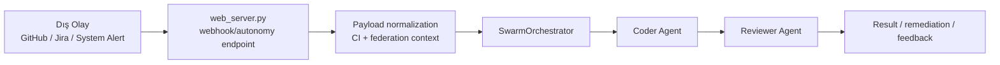

# SİDAR v5.1 — Faz C Derinleşme ve İleri Otonomi Mimari Raporu

> **Durum:** v5.2.0 runtime baseline üzerinde Faz C yetenekleri ile Faz D kurumsal ölçekleme teslimatları senkronize edilmiş, Faz E (Coverage ve Poyraz ajanları) fiili olarak mimariye entegre edilmiştir.
> **Hazırlanma Tarihi:** 2026-03-21
> **Kapsam:** `web_ui_react/src/components/VoiceAssistantPanel.jsx`, `web_ui_react/src/hooks/useVoiceAssistant.js`, `core/voice.py`, `web_server.py`, `core/ci_remediation.py`, `agent/sidar_agent.py`, `agent/roles/reviewer_agent.py`, `agent/roles/coverage_agent.py`, `agent/roles/poyraz_agent.py`, `managers/code_manager.py`, `managers/browser_manager.py`, `agent/swarm.py`, `github_upload.py`, `web_ui_react/src/components/PluginMarketplacePanel.jsx`, `web_ui_react/src/components/AgentManagerPanel.jsx`, `web_ui_react/src/hooks/useWebSocket.js`, `tests/test_plugin_marketplace_hot_reload.py`, `tests/test_collaboration_workspace.py`, `tests/test_nightly_memory_maintenance.py`, `tests/test_system_health_dependency_checks.py`, `runbooks/chaos_live_rehearsal.md`, `agent/tooling.py`, `core/multimodal.py`, `core/db.py`, `migrations/versions/0001_baseline_schema.py`, `migrations/versions/0002_prompt_registry.py`, `migrations/versions/0003_audit_trail.py`, `migrations/versions/0004_faz_e_tables.py`

---

## 1. Yönetici Özeti

SİDAR artık yalnızca backend tarafında güçlü capability'lere sahip bir AI yardımcı değil; React istemcisi, WebSocket ses akışı, self-healing remediation döngüsü ve event-driven swarm federation zinciriyle daha bütüncül bir **AI Agentic Worker** omurgasına yaklaşmıştır. Faz C derinleşmesi dört eksende somutlaşmaktadır:

1. **Client-side voice UX:** `VoiceAssistantPanel` + `useVoiceAssistant` ikilisi, mikrofon erişimi, canlı VAD, transcript, diagnostics ve barge-in görünürlüğünü React SPA içine taşır.
2. **Self-healing loop:** CI failure bağlamı `core/ci_remediation.py` içinde normalize edilir; `agent/sidar_agent.py` düşük riskli patch planı üretir, `CodeManager` sandbox'ında doğrular ve başarısız olursa rollback uygular.
3. **Deeper browser decisioning:** `BrowserManager`, screenshot ve DOM yakalama sinyallerini reviewer/browser tooling katmanına taşıyarak deterministik selector odaklı operasyonları güçlendirir.
4. **Event-driven federation:** Webhook/cron/federation olayları `web_server.py` tarafından normalize edilip `SwarmOrchestrator` üstünde Coder → Reviewer pipeline'ına dağıtılır.

---

## 2. Faz C Bileşen Haritası

| Başlık | Uygulama yüzeyi | Mimari sonuç |
|---|---|---|
| Client-side duplex voice | `VoiceAssistantPanel.jsx`, `useVoiceAssistant.js`, `/ws/voice`, `core/voice.py` | Kullanıcı sesi, VAD ve TTS döngüsü tam çift yönlü UX olarak görünür hale geldi. |
| Otonom remediation | `core/ci_remediation.py`, `agent/sidar_agent.py`, `managers/code_manager.py` | Düşük riskli CI arızalarında patch + sandbox validation + rollback zinciri kurulmuş oldu. |
| Reviewer kalite kapısı | `agent/roles/reviewer_agent.py`, `core/rag.py`, `managers/browser_manager.py` | LSP, GraphRAG ve browser sinyalleri ortak inceleme yüzeyine aktı. |
| Event-driven federation | `web_server.py`, `agent/swarm.py`, `github_upload.py` | Dış olaylar doğrudan çok ajanlı workflow'a dönüştürülebiliyor. |

---

## 3. Client-Side Voice Mimari Akışı

### 3.1 Bileşen sorumlulukları

- **`VoiceAssistantPanel.jsx`** kullanıcıya mikrofon durumu, transcript, VAD seviyesi, interruption nedeni, turn numarası ve buffered byte bilgisini gösterir.
- **`useVoiceAssistant.js`** `getUserMedia`, `MediaRecorder`, `AnalyserNode` ve `/ws/voice` bağlantısını tek hook altında birleştirir.
- **`core/voice.py`** duplex state, assistant turn metadata, VAD event'leri ve TTS segmentasyonunu yönetir.
- **`web_server.py` `/ws/voice`** auth, payload limitleri, transcript/voice_state yayınları ve voice interruption olaylarını taşır.

### 3.2 Veri akışı

```mermaid
flowchart LR
    A[React UI
VoiceAssistantPanel] --> B[useVoiceAssistant
MediaRecorder + VAD]
    B --> C[/ws/voice WebSocket]
    C --> D[web_server.py
voice session/auth]
    D --> E[core/voice.py
buffer + VAD + duplex state]
    E --> F[STT / transcript]
    E --> G[TTS segmentleri]
    F --> C
    G --> C
    C --> B
    B --> A
```

### 3.3 Faz C kazanımı

Bu akış sayesinde barge-in yalnızca backend olayından ibaret değildir; istemci state'i de `playing → interrupted → capturing` geçişini görünür biçimde izler. Böylece sesli kod inceleme veya incident triage oturumları ürün UX'inin bir parçasına dönüşür.

---

## 4. Self-Healing ve Otonom Remediation

### 4.1 Akış tanımı

1. CI başarısızlığı webhook veya autonomy trigger olarak alınır.
2. `core/ci_remediation.py`, kök neden özeti, şüpheli dosyalar, güvenli validation command'ları ve remediation loop planını üretir.
3. `agent/sidar_agent.py`, yalnızca düşük riskli ve geri alınabilir patch operasyonlarına izin veren JSON planı ister.
4. `managers/code_manager.py`, patch'leri uygular ve validation komutlarını sandbox içinde çalıştırır.
5. Doğrulama başarısız olursa dosya snapshot'ları üzerinden rollback uygulanır; yüksek riskli akışlar HITL onayına döner.

### 4.2 Karar ilkeleri

- **Fail-safe:** Patch planı boşsa veya yalnızca güvenli komutlara uymuyorsa uygulama bloklanır.
- **Rollback-first güvenlik:** Doğrulama başarısız olduğunda değişiklikler geri alınır.
- **Scope control:** Görev kapsamı remediation loop içindeki dosyalarla sınırlandırılır.
- **Human override:** Timeout, yüksek risk veya kapsam dışı mutasyon durumunda HITL devreye girer.


### 4.3 Asenkron Güvenlik ve Kilit (Lock) Mekanizmaları

- **Thread-Safe Otonomi:** SİDAR ajanının kendi kendine iyileşme (self-heal) ve gece bakımı (nightly maintenance) gibi arka plan görevleri, olası eşzamanlı (race condition) senaryolarına karşı `_autonomy_lock` ve `_nightly_maintenance_lock` (`asyncio.Lock`) objeleriyle tam koruma altına alınmıştır.
- **Lazy Initialization:** Python'ın event loop kısıtlamaları gereği, asenkron kilitler `__init__` bloğunda senkron olarak değil, ilk çağrıldıkları anda (lazy init) güvenli bir şekilde oluşturulmaktadır. Bu yaklaşım, container/Kubernetes tabanlı dağıtık ölçeklemelerde event-loop uyumsuzluğu kaynaklı çökme riskini ortadan kaldırır.

---

## 5. Browser Decisioning Derinleşmesi

`managers/browser_manager.py` mevcut haliyle Playwright/Selenium oturumu açma, URL gezme, selector tabanlı tıklama/doldurma, screenshot alma ve DOM yakalama yeteneklerini güvenli alan/adres politikaları ve HITL geçidiyle sunar. Faz C bağlamında bunun mimari anlamı şudur:

- Reviewer ajanı browser_signals aracıyla ekran görüntüsü, URL, selector ve DOM özetini kalite kapısına taşıyabilir.
- Tarayıcı etkileşimleri serbest-form LLM tahmini yerine typed tool schema + selector odaklı adımlarla yürür.
- Dinamik UI drift'leri artık yalnızca metin loglarıyla değil, DOM/screenshot kanıtlarıyla değerlendirilebilir.

> Not: Mevcut kod tabanı DOM capture + screenshot + selector tabanlı deterministik akış sunmaktadır; daha ileri görsel işaretleme katmanları sonraki iterasyon için doğal genişleme alanıdır.

---

## 6. Event-Driven Swarm Federation

### 6.1 Olay akışı



### 6.2 Mimari sonucu

- GitHub PR/CI olayları, Jira issue açılışları ve sistem alarmları doğrudan görev zarfına dönüştürülebilir.
- Coder ve Reviewer aynı correlation-id ile pipeline içinde çalışır.
- Üretilen federation sonucu hem dış sisteme geri taşınabilir hem de SidarAgent external trigger hafızasına kaydedilebilir.

---

## 7. Operasyonel Doğrulama ve Test Eşleşmesi

| Alan | İlgili testler |
|---|---|
| Duplex voice pipeline | `tests/test_voice_pipeline.py`, `tests/test_web_server_voice.py` |
| Browser automation / browser signals | `tests/test_browser_manager.py` |
| Self-healing remediation | `tests/test_ci_remediation.py`, `tests/test_web_server_autonomy.py` |
| Federation ve contracts | `tests/test_contracts_federation.py`, `tests/test_web_server_autonomy.py` |

---

## 8. Sonuç

Faz C derinleşmesi, SİDAR'ın mimarisini üç açıdan olgunlaştırmıştır: kullanıcı deneyimi istemci tarafında sesli etkileşimi görünür hale getirmiştir; backend tarafında self-healing ve event-driven federation ile reaktif model aşılmıştır; reviewer/browser/GraphRAG birleşimi ise karar kalitesini ve denetlenebilirliği artırmıştır. Bu nedenle v5.1 mimari raporu, mevcut kod tabanını v5.0'ın ötesine geçen bir **ileri otonomi baseline'ı** olarak belgelemektedir.

## 8.1 Orta Vade Mimari Hazırlıklar: GraphRAG ve Dağıtık Swarm

1. **GraphRAG + Knowledge Graph derinleşmesi:** Mevcut `pgvector` odaklı retrieval omurgası, varlık/ilişki çıkarımı yapan bir Knowledge Graph katmanı ile eşleştirilerek çok adımlı ve kompleks problemlerde bağımlılık zincirlerini, aktörler arası ilişkileri ve görevler arası nedenselliği daha doğru modelleyecek şekilde genişletilmelidir.
2. **İlişkisel çıkarımın reviewer/remediation döngüsüne bağlanması:** Knowledge Graph düğümleri yalnızca arama kalitesini artırmak için değil; reviewer etki analizi, self-healing remediation planı ve external trigger korelasyonu için de ikincil karar yüzeyi olarak kullanılmalıdır.
3. **Dağıtık swarm hazırlığı:** Ajanların tek bir Python süreci içinde çalıştığı mevcut topoloji, Kubernetes pod'ları seviyesinde izole edilmiş uzman worker'lara ayrılacak şekilde evrilmelidir. Bu dönüşüm için görev sözleşmeleri, broker mesaj şemaları, correlation-id taşıma ve retry/timeout politikaları bugünden standartlaştırılmalıdır.
4. **Broker tabanlı orkestrasyon:** RabbitMQ/Kafka benzeri message broker katmanı, swarm görevlerini kuyruklayan, tenant izolasyonunu güçlendiren ve yatay ölçeklemeyi kolaylaştıran ana omurga olarak konumlandırılmalıdır. Böylece dağıtık sürü mimarisine geçiş yalnızca altyapı değil, gözlemlenebilirlik, hata toleransı ve güvenlik sınırları bakımından da kontrollü hazırlanmış olur.
5. **Continuous Learning (Sürekli Öğrenme) Altyapısı:** `config.py` düzeyinde `ENABLE_CONTINUOUS_LEARNING` bayrağı ve ilgili SFT/preference konfigürasyonları eklenmiştir. Bu yapı, LLM-as-a-judge sisteminden gelen feedback'lerin birikerek modeli (LoRA/QLoRA üzerinden) otonom biçimde eğitmesi için gerekli pipeline'ın temelini oluşturmaktadır.

---

## 9. Faz E: Otonom İş Ekosistemi (Poyraz & Coverage)

### 9.1 Test Otomasyonu (Coverage Ajanı)

- `agent/roles/coverage_agent.py`, `BaseAgent` üstünde `run_pytest`, `analyze_pytest_output`, `generate_missing_tests` ve `write_missing_tests` araçlarını `register_tool(...)` ile kaydeden fiili bir QA ajanı olarak sisteme eklendi.
- **Kayıtlı tool seti (teyit):** `run_pytest`, `analyze_pytest_output`, `generate_missing_tests`, `write_missing_tests`.
- Ajan, `SecurityManager` ile oluşturulan `CodeManager` üzerinden `run_pytest_and_collect(...)` çağrısını çalıştırıyor; pytest çıktısını `analyze_pytest_output(...)` ile normalleştiriyor, ilk bulguya göre hedef dosya için test adayı üretip önerilen `tests/test_<modül>_coverage.py` yoluna yazabiliyor.
- Çalışma döngüsü yalnızca test üretmekle sınırlı değil; `core/db.py` içindeki `create_coverage_task(...)` ve `add_coverage_finding(...)` yardımcıları üzerinden `coverage_tasks` / `coverage_findings` kayıtları kalıcı hale getiriliyor. Böylece Coverage Agent, “çalıştır → analiz et → testi yaz → bulguyu kaydet” zincirini fiilen tamamlayan bir Faz E kalite halkası haline geldi.

### 9.2 Dijital Pazarlama & Operasyonlar (Poyraz Ajanı)

- `agent/roles/poyraz_agent.py`, `WebSearchManager`, `SocialMediaManager` ve `DocumentStore` entegrasyonlarıyla çalışan aktif bir pazarlama/operasyon ajanıdır. Kurucu katmanda `web_search`, `fetch_url`, `search_docs`, `publish_social`, `publish_instagram_post`, `publish_facebook_post`, `send_whatsapp_message`, `build_landing_page`, `generate_campaign_copy`, `ingest_video_insights`, `create_marketing_campaign`, `store_content_asset`, `create_operation_checklist` ve `plan_service_operations` araçları `register_tool(...)` ile sisteme kaydedilir.
- **Kayıtlı tool seti (teyit):** `web_search`, `fetch_url`, `search_docs`, `publish_social`, `publish_instagram_post`, `publish_facebook_post`, `send_whatsapp_message`, `build_landing_page`, `generate_campaign_copy`, `ingest_video_insights`, `create_marketing_campaign`, `store_content_asset`, `create_operation_checklist`, `plan_service_operations`.
- Bu tasarım sayesinde Poyraz yalnızca serbest metin üreten bir rol değildir; `publish_instagram_post` ve `send_whatsapp_message` ile doğrudan kanal aktivasyonu yapar, `build_landing_page` ve `generate_campaign_copy` ile içerik üretir, `create_marketing_campaign` / `store_content_asset` / `create_operation_checklist` ile tenant-aware operasyon kayıtlarını kalıcılaştırır.
- `core/db.py` içindeki `upsert_marketing_campaign(...)`, `add_content_asset(...)` ve `add_operation_checklist(...)` yardımcıları; `marketing_campaigns`, `content_assets` ve `operation_checklists` tablolarını hem SQLite hem PostgreSQL init-schema akışında hazırlar. Bu şema yüzeyi artık `migrations/versions/0004_faz_e_tables.py` ile resmi Alembic zincirine alınmış durumdadır; böylece Faz E veri modeli uygulama başlatma akışına ek olarak migration geçmişinde de izlenebilir hale gelmiştir.

### 9.3 Genişletilmiş Multimodal Zeka

- Poyraz'ın `ingest_video_insights` aracı, `core.multimodal.MultimodalPipeline` örneğini doğrudan başlatır ve `analyze_media_source(...)` çağrısıyla dış video URL'lerinden sahne özeti, ingest metadatası ve `DocumentStore` beslemesi üretir.
- **Dış sistem bağımlılığı teyidi:** `core/multimodal.py` URL/video ingest akışında sistem seviyesinde `yt-dlp`, `ffmpeg` ve `whisper` CLI varlığını kullanır; bu nedenle multimodal pipeline bu yardımcı araçların kurulu olduğu host/container ortamını gerektirir.
- Üretilen sonuç, `document_ingest` bilgisiyle birlikte kampanya üretimine geri bağlanır; böylece video çözümleme artık yalnızca teknik demo değil, pazarlama brief'i ve içerik üretimi için kullanılan aktif Faz E veri kanalıdır.
- Bu yapı, multimodal katmanı geliştirici odaklı medya özetinden çıkarıp operasyon ve gelir tarafını besleyen stratejik veri boru hattına dönüştürmüş durumdadır.

### 9.4 Yapısal Yerleşim Taslağı (Tablolar ve API Uçları)

| Faz E bileşeni | Kullanacağı mevcut yüzeyler | Önerilen yeni tablo/endpoint taslağı | Not |
|---|---|---|---|
| Coverage Agent | `managers/code_manager.py`, `agent/sidar_agent.py`, `core/db.py`, `/api/swarm/execute`, CI test akışları | `coverage_tasks`, `coverage_findings`, `/api/qa/coverage/run`, `/api/qa/coverage/findings` | Ajan kodda aktif; API yüzeyi için formal endpoint katmanı doğal sonraki adım olarak duruyor. |
| Poyraz Ajanı | `agent/tooling.py`, `web_server.py` auth/audit/multitenancy, `managers/social_media_manager.py`, `managers/web_search.py`, `core/multimodal.py`, `core/db.py` | `marketing_campaigns`, `content_assets`, `operation_checklists`, `/api/operations/campaigns`, `/api/operations/content/generate`, `/api/integrations/social/publish` | Ajan kodda aktif; CRUD/API katmanı için web yüzeyine taşınacak operasyon kapıları netleşmiş durumda. |
| YouTube / dış video analizi | `core/multimodal.py`, `web_server.py` upload/vision akışları, RAG/DocumentStore | `media_ingestion_jobs`, `media_scene_segments`, `media_transcripts`, `/api/media/analyze-url`, `/api/media/jobs/{job_id}`, `/api/media/transcripts/{job_id}` | URL tabanlı ingest, FFmpeg sahne/segment çıkarımı ve özet metin üretimi. |

#### 9.4.1 Coverage Agent veri ve kontrol akışı

- Coverage Agent, CI veya yerel `pytest --cov` çıktısını görev tetikleyicisi olarak alıyor; ham pytest/coverage özeti `coverage_tasks` içine yazılıyor ve her bulgu `coverage_findings` tablosunda normalize ediliyor.
- `managers/code_manager.py`, eksik test önerilerini üretmek, kaynak dosya pasajını okumak ve önerilen testi diske yazmak için etkin eylem yüzeyi olmaya devam ediyor.
- Resmi `/api/qa/coverage/*` uçları henüz belgelenmiş taslak aşamasında olsa da veri modeli ve ajan kontrol akışı kod tabanında aktiftir; bu da UI veya swarm paneli için geri okunabilir bir coverage görev kuyruğu hazırlar.
- Böylece mevcut `prompt_registry`, audit log ve HITL mekanizmalarıyla uyumlu, insan onayı eklenebilir bir test otomasyonu hattı fiilen oluşmuştur.

#### 9.4.2 Poyraz ajanı için operasyon omurgası

- `marketing_campaigns` tablosu tenant, kanal, hedef, bütçe, durum ve sahip bilgilerini; `content_assets` tablosu kampanya varlıklarını (landing page, kampanya kopyası, brief, kanal içeriği); `operation_checklists` ise operasyon maddelerini kalıcı olarak taşıyor.
- Poyraz bu tabloları doğrudan `upsert_marketing_campaign`, `add_content_asset` ve `add_operation_checklist` yardımcılarıyla dolduruyor; yani içerik üretimi ile operasyon kaydı aynı ajan içinde birleşmiş durumda.
- `/api/operations/campaigns`, `/api/operations/content/generate` ve `/api/integrations/social/publish` uçları mimari olarak hâlâ doğru yönü gösteriyor; ancak güncel kod tabanında asıl üretim davranışı agent tool katmanı üzerinden yürütülüyor.
- Böylece Poyraz, serbest metin üreten bir ajan yerine tenant-aware, denetlenebilir ve başarımı ölçülebilir bir iş akışı ajanı haline gelmiş durumdadır.

#### 9.4.3 YouTube video analizi ve multimodal ingest

- `media_ingestion_jobs`, URL tabanlı ingest yaşam döngüsünü (queued, downloading, segmented, transcribed, summarized, failed) izler; job metadata'sı içerik kaynağı, kanal, süre, dil ve işleme maliyeti alanlarını taşımalıdır.
- FFmpeg ile çıkarılan sahne/kare segmentleri `media_scene_segments` içinde zaman kodlarıyla tutulur; transcript ve özet parçaları `media_transcripts` altında aranabilir metin olarak saklanıp RAG'e bağlanabilir.
- Poyraz içindeki `ingest_video_insights` aracı, dış video URL'sini doğrudan `MultimodalPipeline.analyze_media_source(...)` çağrısına vererek job benzeri bir ingest sonucu üretir; sahne özeti ve ingest metadata'sı ajan yanıtına geri taşınır.
- Bu akış sonunda üretilen sahne özeti ve transcript, `DocumentStore` içine ingest edilerek hem pazarlama üretimini hem de kurumsal bilgi geri çağırımını besler.

### 9.5 Öncelikli Uygulama Sprinti (Faz E → Faz F Geçiş Kapısı)

#### 9.5.1 Poyraz ve Coverage REST uçlarını üretime alma

- **Hedef:** Taslak durumda listelenen `/api/operations/campaigns`, `/api/operations/content/generate`, `/api/integrations/social/publish`, `/api/qa/coverage/run`, `/api/qa/coverage/findings` uçlarını `web_server.py` içinde resmi route olarak aktifleştirmek.
- **Teslimat yaklaşımı:** Önce read-only listeleme + detay uçları, ardından tetikleyici (run/publish/generate) uçları; tüm write operasyonları için audit + tenant zorunluluğu.
- **Frontend bağı:** `web_ui_react` içinde Campaign/Coverage panelleri bu uçlara bağlanmalı; SwarmFlowPanel üstünden coverage görev rerun ve kampanya tetikleme aksiyonları sağlanmalı.
- **Çıkış kriteri:** En az bir uçtan uca akışın (UI → API → DB → audit log) otomasyon testleriyle doğrulanması.

#### 9.5.2 Dağıtık Swarm çekirdeğini başlatma

- **Hedef:** Tek event-loop ve `asyncio.Lock` tabanlı süreç içi koordinasyondan, broker destekli worker topolojisine kontrollü geçiş.
- **İlk adım:** `SwarmOrchestrator` için `TaskEnvelope` (tenant_id, correlation_id, trace_id, retry_count, timeout_ms) sözleşmesini sabitlemek ve queue adapter arayüzü (`publish`, `consume`, `ack`, `nack`) tanımlamak.
- **Broker seçimi:** İlk sprintte RabbitMQ ile kuyruk prototipi; ikinci sprintte Kafka opsiyonu için aynı adapter sözleşmesi korunmalı.
- **Çıkış kriteri:** En az iki ajan rolünün (ör. coder + reviewer) ayrı worker process/pod üzerinde dağıtık çalıştırıldığı demo ve failure retry gözlemi.

#### 9.5.3 GraphRAG + Knowledge Graph genişlemesi

- **Hedef:** `pgvector` retrieval katmanını, ilişki/varlık tabanlı sorgu yeteneği ile tamamlayacak Graph katmanını devreye almak.
- **Teknik yön:** Neo4j (veya eşdeğer graph store) için `entity`, `relation`, `evidence_ref` şeması; GraphRAG sorgularında vektör sonuçlarıyla graph traversal sonuçlarının birleştirilmesi.
- **Entegrasyon noktası:** Reviewer ajanında risk analizi ve kök neden ilişkilendirmesinde graph sinyali ek bir karar girdisi olarak kullanılmalı.
- **Çıkış kriteri:** Aynı vaka için “yalnızca vektör” ve “vektör + graph” çıktılarının kalite karşılaştırmasını gösteren ölçümlü değerlendirme raporu.
